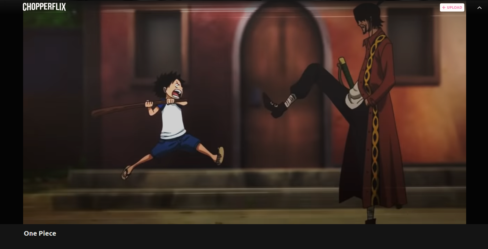
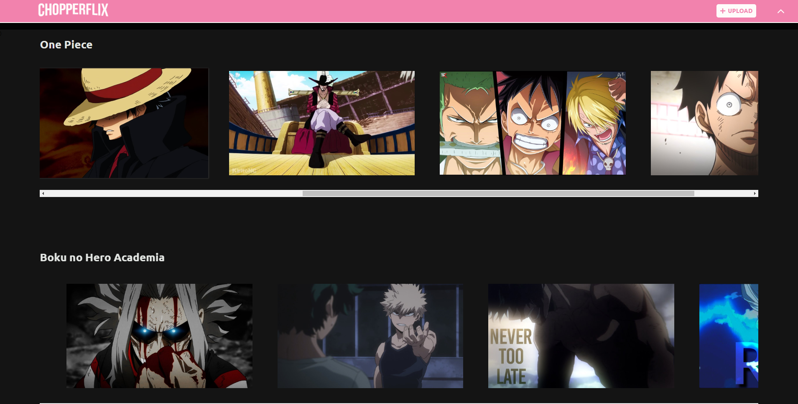
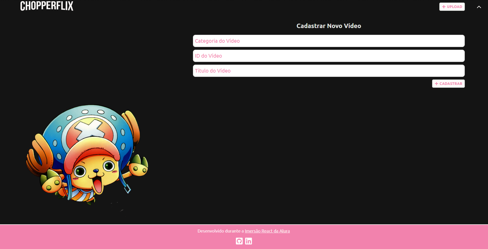

# 📼 Chopperflix

> Um hub para AMV's legais 😎

<p align="center">
  
  
  
</p>

Um clone da Netflix utilizando algumas cores da paleta do personagem Tony Tony Chopper do One Piece, baseando-se nas video aulas da
Imersão React da [Alura](https://www.alura.com.br/)





## Instalação

Clonar esse repositório e rodar um

```
yarn
```

ou

```
npm install
```

## Contato

Carlos Castro – [Linkedin](https://www.linkedin.com/in/carlos-castro-6623581a8/) – contato-carloscastro@hotmail.com

Esse projeto está sob a licença MIT. Veja `LICENSE` para mais informações.

## ToDo

- Backend;

## Contribuindo

1. Crie um fork desse repositório (<https://github.com/AdmiralChopper/imersao-react-alura/fork>)
2. Crie uma branch para a feature proposta (`git checkout -b feature/fooBar`)
3. Faça um commit com as mudanças (`git commit -am 'Add some fooBar'`)
4. Dê um push para o GitHub (`git push origin feature/fooBar`)
5. Crie uma Pull Request e aguarde revisão.
